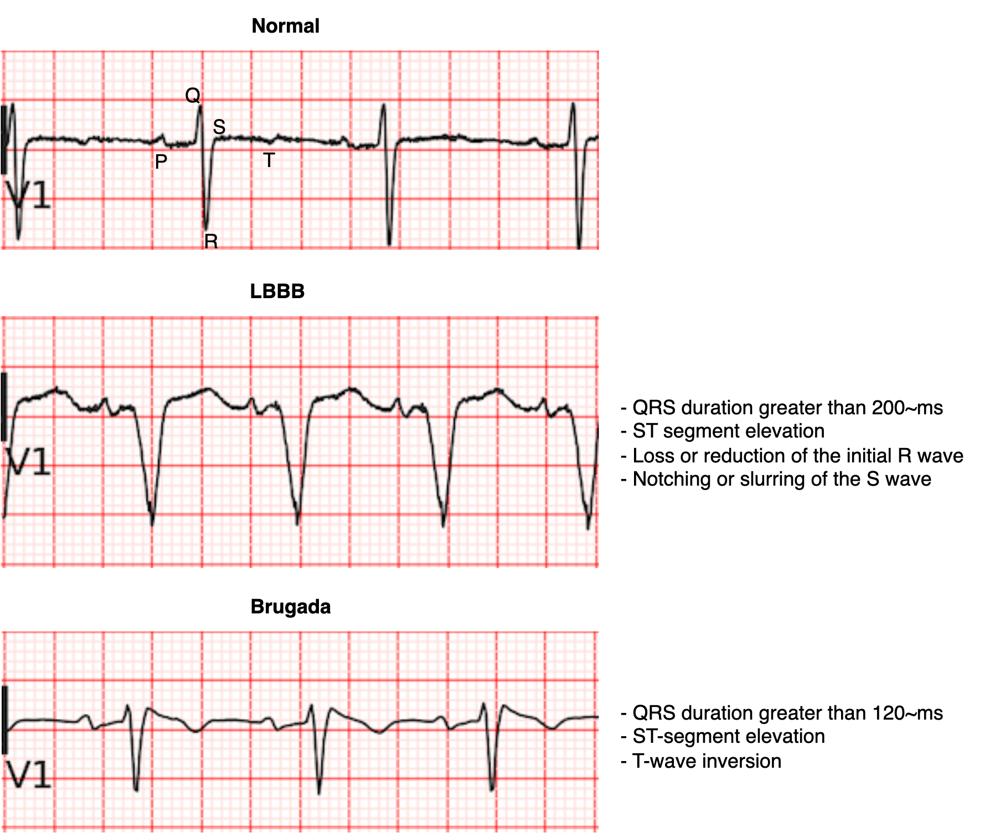

# ECG In-Context Learning with Concept Bottleneck Prompts

This repository contains the code for the paper "Can In-Context Learning enable Large Vision Language Models to detect ECG abnormalities?", presented at the ["I Congreso de la Sociedad Española de IA en Biomedicina"](https://2025.iabiomed.org/).

## Overview
Electrocardiogram interpretation is critical for clinical decision making, yet traditional machine learning pipelines struggle when rare pathologies are scarce in training data. This work explores whether large vision-language models can be adapted on the fly for ECG understanding by pairing in-context learning (ICL) with concept bottleneck prompting. The model first reasons about clinically meaningful intermediate concepts and then produces a diagnosis, yielding structured, interpretable predictions without updating model parameters.

## Evaluation Snapshot
- Left Bundle Branch Block detection using a balanced 2,000-sample subset of MIMIC-IV-ECG (1,000 normal, 1,000 LBBB), each from unique patients.
- Brugada syndrome classification on a 200-sample clinical cohort (125 normal, 75 Brugada) collected at Hospital Universitario Central de Asturias with institutional ethical approval and expert annotations.

## Takeaways
Combining ICL with concept bottleneck prompts produces interpretable ECG analyses while maintaining competitive performance in data-constrained settings. The approach offers a practical path for extending vision-language models to underrepresented cardiac conditions without extensive retraining.

